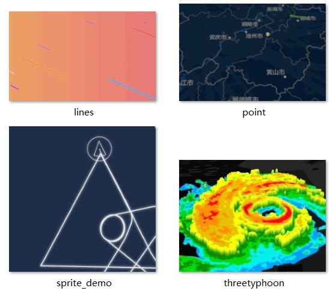

## 关于我

黄益修，热爱数据可视化的前端工程师，喜欢摄影、烹饪、炒股买基、带娃中~

电子邮箱：huangyixiu188@hotmail.com

[Github Profile](https://github.com/alex2wong)

[掘金博客](https://juejin.im/user/599a92686fb9a0249f6a1f5a/posts)

硕士期间主要研究地图学与地理信息系统，位置信息分析与可视化

### Tech Stack

- `JavaScript`, `TypeScript`, 了解`node.js`文本读写，网络编程，了解`websocket` 

- `Vue.js`, `vue-router`, `Webpack` Config, SPA、多页面打包, webapp 大小裁剪，首屏优化

- `Python` 文本处理、网络请求、自动化脚本

- GIS数据结构与算法, 熟练使用`OpenLayers`/`Mapbox`等开源地图API，熟悉位置数据可视化与分析技术

- 了解`React.js`, `react-native`跨平台开发

### Working Experience

- 2016.7-至今 音墙网络（上海）有限公司

职位：前端开发工程师 

负责公司防火墙管理界面的维护和升级，并基于`vue.js`开发维护新一代的通用UI组件库。主要负责`SSLVPN`产品的
前端开发项目,重点负责无线设备云管理产品的地图组件、拓扑图组件开发与维护。维护SSLVPN html5 bookmark
等app的页面性能，保证用户的使用体验，解决全球各地`SSLVPN` 客户的问题

### Projects

- 2019.6-至今

移动端 Cloud Management App 的开发，基于react-native开发移动端App，支持对账户下所有防火墙设备进行查看和管理。

主要负责 `Icon`、
`Expandable List`、`Bottom Modal`、筛选套件等组件开发，`Dashboard、Policy`等页面的开发维护。参与了最初始的项目搭建、navigation 的设计与实现

- 2019.2-2019.8 公司 Wireless Cloud 管理系统开发与维护

参与公司云防火墙管理系统的前端开发，基于公司新一代UI组件库的项目模板直接构建项目，主要负责以下几个功能模块

1. 支持table导出PDF和excel的通用service开发

2. 支持地理位置预览的地图组件，对接后
台Google geocoding API

3. 基于 `D3-force` 的网络拓扑图组件

4. 多页面打包和bundle拆分以减少首屏加载
时间；多页面骨架屏的实现，优化用户体验。

项目优化使得原本单页面的app，拆分为多个页面入口，每个页面首屏资源大小不超过500Kb，首屏加载时间提速数倍

- 2018.4-至今 公司新一代UI组件库开发与维护 

参与开发公司通用的UI组件库，贡献了`slider、datepicker`、地图和图表等核心组件，并提供长期的维护支持。项目基于`vue.js+vuex+webpack`实现，有较为完整的产品线，包括基础组件库，模板项目，`jest`单元测试，`Gitlab CI/CD`。组件库提供主题切换，模块化的各类UI组件，通用指令，API适配层等

### 开源项目

[↑ 基于canvas的mapbox-gl插件库](https://github.com/alex2wong/mapbox-plugins)

[↑ canvas 音频可视化库 vudio.js](https://github.com/alex2wong/vudio.js)

[《权力的游戏》交互式故事地图](https://github.com/alex2wong/Game-of-Throne-Map)

[动态自定义网站主题的前后端实现](https://github.com/alex2wong/theme-switcher)

[多人在线飞机大战](https://github.com/alex2wong/Jqmap2)

`Echarts contributor` issue fix 和社区讨论 

### 技术分享

> Angular2.x Introduction （Angular 2.x 入门简介，数据绑定和指令原理）

> Introduction to Unified UI framework （基于vue.js 的通用UI 组件库原理与使用） 

> On prem map solution （离线设备地图组件方案）
