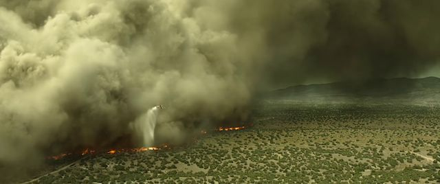

## 关于博客

普通的`markdown`博客无法插入音频，`iframe`, 或者其他可交互的内容，所以我借助`vuepress`重新做了一套博客系统。

这个夏天真是漫长而热烈，经历了台风利奇马，呼啸的强热带风暴带来难得的凉意，但也带来了巨大的灾害损失。台风、森林火灾、地震等等自然灾害面前，人类永远是弱小的。普通人无法想象蔓延几十公里的山火，几公里的浓烟阻挡，能见度只有几米甚至伸手不见五指。在山火这庞然大物面前，消防飞机就像孩子的玩具，所携带的灭火材料只是杯水车薪。

所以真的要感谢这些勇敢的同胞，抗击台风、山火的普通人们，没有他们的勇敢，我们无法享受这份恬静。

我们只看到一个安静的夏天，在空调房里望着窗外热烈的阳光，绿树成荫，在家静静地、盲目地敲着代码，也不知道明年的自己会是什么样子。这时候就喜欢翻翻照片，回忆和家人一起欢乐的时光，哈哈哈。

从来没有什么岁月静好，只是有人替我们负重前行，所以要珍惜自己拥有的，做点有价值的事，开心的事~ :)
